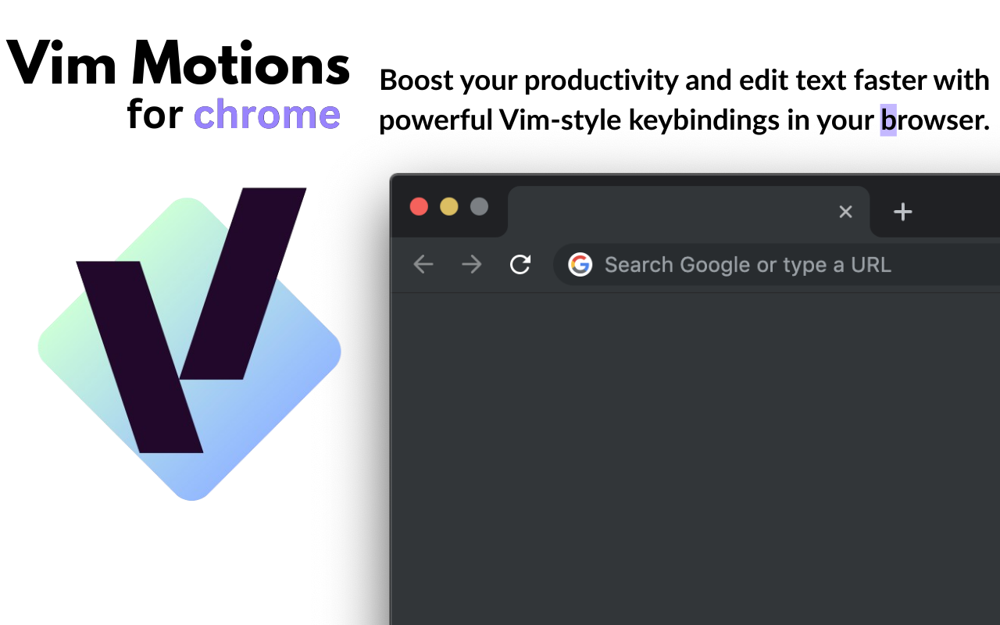
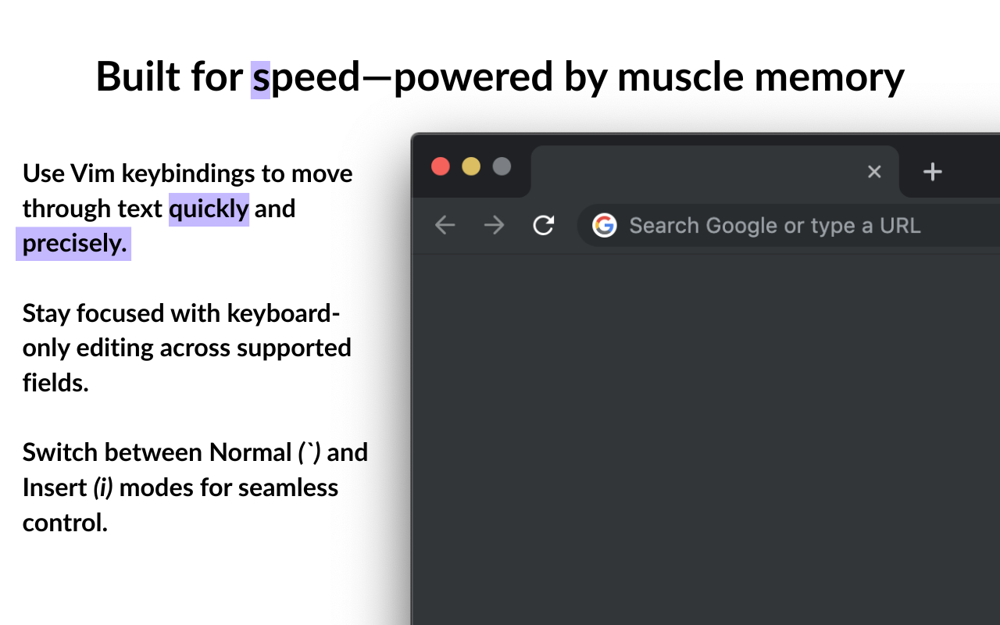

# VimMotions

---

# Vim-like Keybindings for Browser Text Inputs (Alpha v1.022)

This Chrome extension provides Vim-like keybindings for navigating and editing text in various text input elements, such as standard text boxes, contenteditable fields, and virtual DOM-based text inputs (like Google Docs, VS Code, etc.). Currently in the alpha stage, this extension aims to bring a familiar and efficient text-editing experience to web-based text input fields.

https://github.com/user-attachments/assets/20addd85-0549-4404-918f-7b27b7d433fe

## Current Features (Alpha v1.022)

- **Insert Mode (`i`)**: Press `i` to switch to insert mode.
- **Normal Mode (Backtick)**: Press the backtick (`` ` ``) to return to normal mode.
- **Mode Highlighting – *New in v1.02***:
  - Visual distinction between **Normal Mode** and **Insert Mode** through a new selection/highlighting system.
  - Mimics the feel of Vim’s visual feedback by clearly indicating the active mode.
- **Cursor Navigation**:
  - Move Left (`h`): Move the cursor left by one character.
  - Move Right (`l`): Move the cursor right by one character.
  - Move Up (`k`): Move the cursor up by one line (works in contenteditable elements).
  - Move Down (`j`): Move the cursor down by one line (works in contenteditable elements).
  - Next Word (`w`): Move the cursor to the next word.
  - Previous Word (`b`) – *Added in v1.01*
  - Beginning of Line (`0`) – *Added in v1.01*
  - Append to End of Line (`A`) – *Added in v1.01*
  - Move Right and Switch to Insert Mode (`a`)
  - Delete Character (`x`) *Added in v1.022*
  - Delete Word (`dw`) *Added in v1.022*
  - Delete Line (`dd`) *Added in v1.022*

## Supported Input Types

- **Standard Text Inputs** (`<input>`, `<textarea>`)
- **Contenteditable Fields** (`
`)
- **Virtual DOM-based Text Inputs** (e.g., Google Docs, VS Code-like inputs – *coming soon*)

## Known Issues

- **Contenteditable Issues**:
  - Blank lines cannot be traversed effectively.
  - After refreshing a page, the up and down cursor navigation may not work as intended.
  - Gmail, and possibly other complex contenteditable divs, may have issues where mixed `
` and ` ` elements prevent the cursor from moving as expected.
  
These issues are known and will be addressed in future releases as the extension evolves.

## Future Releases

- **Keybindings Planned**:
  - `e` – Move the cursor forward to the end of the current word
  - `r` - Replace current Character
  - `G` - Move cursor to end of text
  - `gg` - Move cursor to beginning of text
  - Additional commands to support full Vim motion and editing workflows

- **Extended Input Support**:
  - Virtual DOM-based inputs (Google Docs, VS Code, etc.)
  - Broader support for mixed and dynamic input types

The goal is to include most or all of the classic Vim keybindings in future releases.

## Installation

### Install from Chrome Web Store

VimMotions is now available on the [Chrome Web Store](https://chromewebstore.google.com/detail/ejggdgkfjmoggjddkbbmgpkhakgbghmg?utm_source=item-share-cb).  
Click the link to install instantly and receive automatic updates.

### Development Installation

1. Clone or download the repository.
2. Navigate to `chrome://extensions/` in your Chrome browser.
3. Enable **Developer mode** (toggle in the top right).
4. Click **Load unpacked**, and select the extension directory.
5. Once installed, the keybindings will be active on all supported text input elements.

## License

This project is in the early stages of development, and is available for use under the **MIT License**.

